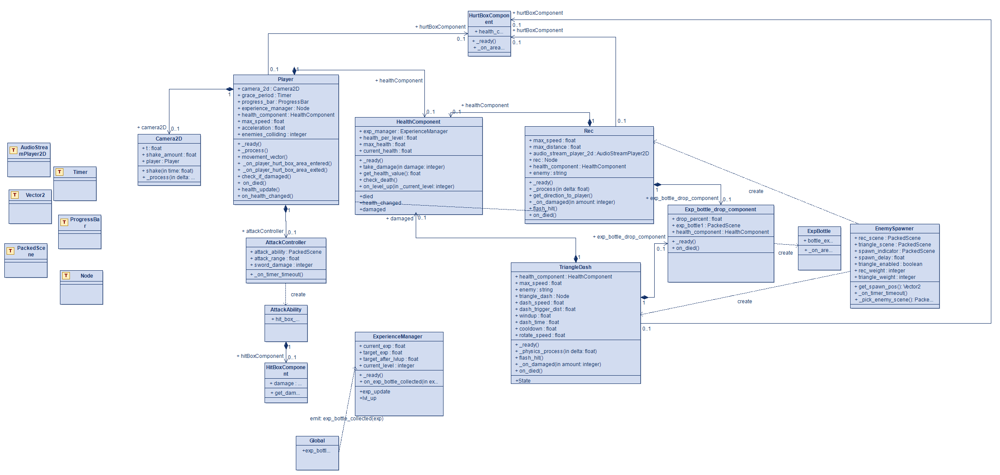
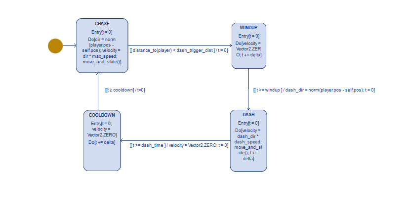

# GeoClash

## 1. Описание проекта
GeoClash — это прототип игры, созданный на движке **Godot Engine 4**.  
Игрок управляет геометрической фигурой, сражающейся с волнами врагов-фигур.  
Цель — выжить как можно дольше, используя систему прокачки способностей.

## 2. UML
Диаграммы класса и состояния находятся в каталоге [`docs/uml`](docs/uml).  

## Диаграммы
**Классы и связи**

**Состояние противника TriangleDash**

## 3. Лицензия
Проект распространяется под лицензией **MIT**.